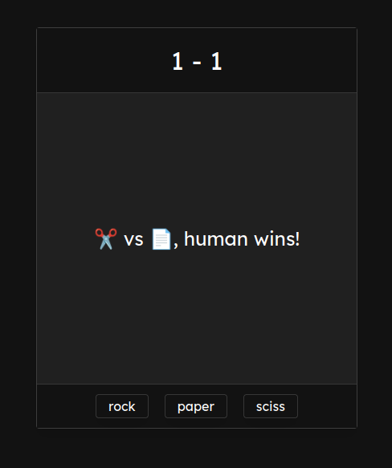

# Rock Paper Scissors

## Description
Simple rock-paper-scissors game, made with HTML, CSS and JS as a basic practice of programming logic with JavaScript, this project is from the foundations section of [The Odin Project](https://www.theodinproject.com) course.

## Demo

  

## Resources
- [minireset.css](https://github.com/jgthms/minireset.css)